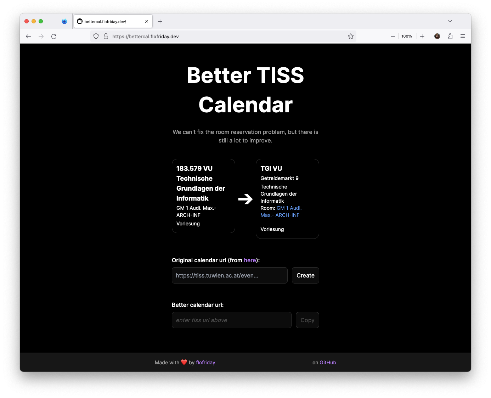
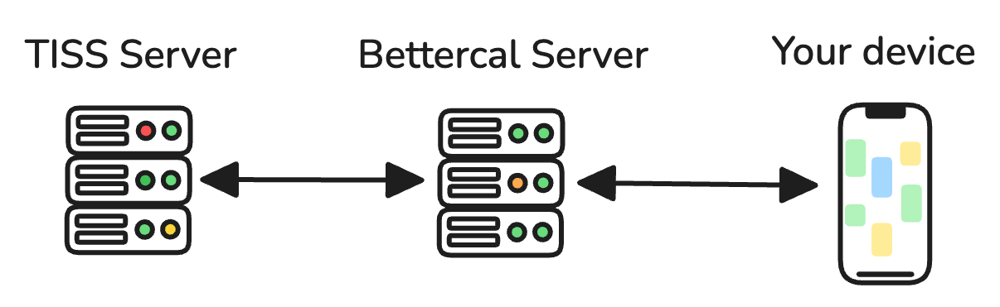

# better-tiss-calendar


TISS is the information service of TU Wien which exports a suboptimal calendar
of events (like lectures). This project improves the calendar by rewriting the
events and enriching them with useful information.

[Live Website](https://bettercal.flofriday.dev)

## Features

- Remove lecture number from the title
- Use shorthands instead of the long name (optional)
- Correct address in the location field, not just the room
- Floor information
- Links to TUW-Maps (and TISS on HTML enabled clients)
- Drop in replacement
- Easy setup: no login, no account and no rage inducing captchas
- Self-hosting friendly

## Importing the calendar

Adding the bettercal calendar to your outlook, google calendar or iPhone app is
identical to the official Tiss calendar. However, if you have never done that
or not in a long time, here are some guides:

- [iPhone](https://support.apple.com/guide/iphone/set-up-mail-contacts-and-calendar-accounts-ipha0d932e96/ios#:~:text=Go%20to%20Settings%20%3E%20Calendar%20%3E%20Accounts,your%20server%20and%20account%20information.)
- [macOS](https://support.apple.com/guide/calendar/subscribe-to-calendars-icl1022/mac#:~:text=In%20the%20Calendar%20app%20on,an%20account%20for%20the%20subscription.)
- [Gmail](https://support.google.com/calendar/answer/37100?hl=en&co=GENIE.Platform%3DDesktop&oco=1) (Note: you can only add it on desktop, but then it will also show up on mobile)
- [Outlook](https://support.microsoft.com/en-us/office/import-or-subscribe-to-a-calendar-in-outlook-com-or-outlook-on-the-web-cff1429c-5af6-41ec-a5b4-74f2c278e98c)

## How it works



Calendar clients download subscribed calendars periodically (some even let you
set the polling rate). Now with bettercal when a request comes in for a calendar this
server downloads the original calendar from tiss and formats all events and
enriches them with more information before returning it to the client.

## Build it yourself

You first need to install [node](https://nodejs.org/en) and [uv](https://github.com/astral-sh/uv).

```bash
npm install
npx @tailwindcss/cli -i app/templates/template.css -o app/static/style.css
uv run flask run --debug
```

The server should now start at http://localhost:5000

**Note:** While working on the frontend, it is quite handy to add the `--watch`
flag to the tailwind command.

**Warning:** The flask server here cannot be used in production and is optimized
for development comfort.

You can run all tests with:

```bash
uv run pytest
```

## Build with Docker

```bash
docker build -t bettercal .
docker run -it --rm -p 5000:5000 bettercal
```

The server should now start at http://localhost:5000

This approach can be used in production. However, statistics will die with the
container, but they can be preserved by adding the
`--mount type=bind,source="$(pwd)"/bettercal.db,target=/app/bettercal.db` argument to the
`docker run` command.

## How we deploy

In production we use the [gunicorn](https://gunicorn.org/) server.
The main branch is automatically deployed as a systemd user service on a linux
box. The systemd config can be read in `bettercal.service`.

## Contributing

Contributions are quite welcome, you are awesome. 😊🎉

If you want to add a shorthand for a lecture, the file you need to edit is
`ressources/shorthands.csv`.

For formatting and linting we use `ruff` and for typechecking `pyright`

```bash
uv run ruff format
uv run ruff check --fix
uv run pyright
```